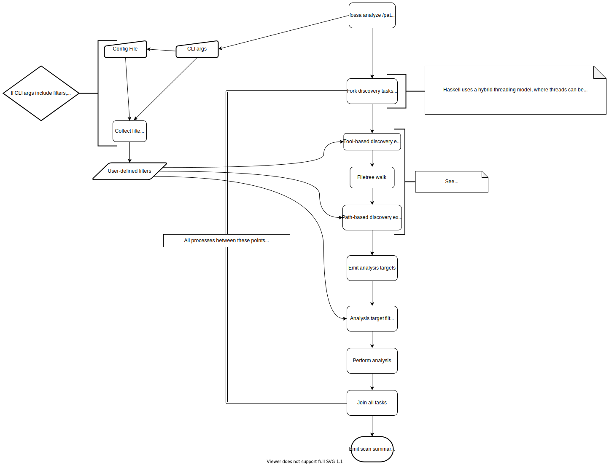

# Filtering projects

For many repositories, including ourselves, our scans will reveal projects that
do not need to be analyzed at all, and could be safely ignored.  We use the
`--{only,exclude}-{path,target}` CLI arguments, or the
`{targets,paths}.{only,exclude}:` config file values to avoid giving users
information they don't care about, or to avoid doing work that will be thrown
away.  This document expresses how that filter process works, and clarifies its
semantics and limitations.

## Shorthand

For this document, we'll use a shorthand like this:

```haskell
-- `--only-path tooling`
include tooling/

-- `--only-target cabal --exclude-path test`
include cabal AND exclude test/

-- `--exclude-path foo/bar`
exclude foo/bar

-- `--exclude-target cargo@baz`
exclude cargo@baz
```

When an argument is ambiguous, trailing slashes are added to paths.  Target
syntax is presented later in the document.

## Background

First, we need to understand how the CLI runs at a broad level.  This model may
change in the future, but will still be broadly applicable for as long as we
follow a 2-phase "discover, then analyze" process.  This diagram shows how the
CLI operates, and where it interacts with the filters:



- Note the threading notes in the diagram, while some of that is important for
implementing safe concurrent code, the important takeaway for this discussion
is that **_every project is discovered and analyzed in complete isolation_**
**_from all other projects_**.

From this diagram, we can see that there are two major processes of each
strategy in the CLI:

- **Discovery**: Walk the filetree and emit "analysis targets".
  - Filtering applied here is called "Discovery exclusion".
- **Analysis**: Analyze each "analysis target" and determine it's dependencies.
  - Filtering here is called "Analysis target filtering".

These two phases are very important, and very different.  Each has different
sets of data known to it, and there are benefits to doing filtering at each
stage. It's also notable that once we emit an analysis target, we track it
until the process terminates.

## The Discovery Phase

Almost all discovery takes the same form:

1. Walk the filetree, and look for "indicator files". An indicator file is any
file that tells us that a specific type of project is rooted in the directory
that that file lives in. Mostly, these are actual project files that we scan,
or run buildtools against.
1. For each directory with indicator files, we capture exactly one "analysis
target" (more on that later), which contains enough info for us to run a
separate "scan for dependencies" task for that target.

There are exceptions to these rules: both maven and nodeJS are capable of
statically analyzing multi-directory workspaces, and therefore do not have a
1:1 relationship between directories with indicator files and analysis targets.
There may be other analyzers that do this in the future.

Discovery that follows the simple model is run via `simpleDiscover`, and makes
up almost every analyzer we currently have.

### Analysis Targets

To the user, an analysis target is a unique combination of
`DiscoveredProjectType` and directory (plus optional subtargets).
`DiscoveredProjectType` always correlates to one of 3 things:

- A single, unified tool, e.g. `cargo`
- A family of tools, e.g. `setuptools` (uses `setup.py` and `requirements.txt`)
- An isolated subset of a tool, e.g. the various `maven` strategies.

To a developer, an analysis target is a `DiscoveredProject a`, which contains
the info above, plus the data `a` found by the discovery process, which is
any extra input needed for the analysis phase.  This is the `projectData` for
that analysis target.  In some cases, we do extra work during discovery, and
we save that data for reuse in the `projectData`.  Notably, maven and nodeJS
discovery both do this, but this is not limited to non-simple discovery.

To actually run analysis, the `projectData` must have a instance of the
`AnalyzeProject` typeclass.  This is not likely to be relevant for the
purposes of filtering, but it's still worth mentioning.

### Subtargets

Some analyzers (currently only gradle) may implement support for partial
analysis, via subtargets.  This works by emitting an additional set of
qualifiers (as simple text), which are decided by the analyzer.  In gradle,
these refer to gradle subprojects.  This is used to only analyze part of a
single analysis target.  We will discuss this more in the next section.

### Syntax

When referring to the analysis targets, we use a string format of the syntax:
`type@path[:subtarget]`. Trailing slashes on the path component are optional.
We construct these string representations like so:

Given the analysis target tuple `(type, path, [list, of, subtargets])`,
we emit one target per subtarget, plus a target with no subtargets.  The target
without a subtarget component is ALWAYS present, even when no subtargets are
found.  This is the most common scenario, since most analyzers do not make use
of subtargets.  For example, the tuple `(cargo, foo/bar, [])` would emit the
single target `cargo@foo/bar`.  The tuple of `(gradle, foo/baz, [subA, subB])`
would emit three targets:

```text
gradle@foo/baz
gradle@foo/baz:subA
gradle@foo/baz:subB
```

## Filtering in General

Because discovery finds everything by default, every filter mechanism is
intended to **reduce** outputs from one stage to the next.  This comes in
2 forms:

- `exclude` - Do not include this item.
- `include` - Do not include anything that _isn't_ this item.

Notably, there is no mechanism for _adding_ items. This is intentional, we
already include everything by default, so what could be added?  As a result,
this can lead to some filtering combinations that seem to produce unintuitive
results: `exclude a/b AND include a/b/c` will remove `a/b/*`, along with the
"included" `a/b/c`.  However, given the reduction-focused nature of the
filters, we can reword this using the descriptions above and see if the
behavior is intuitive there:

```text
exclude a/b AND include a/b/c

-- rewritten:
Do not include a/b (or its children)
AND
Do not include anything that is not a/b/c (or its children)
```

In this wording, it is clear that we must not include `a/b/c`, because it has
been excluded from the results.  In fact, given only these filters, we will
never return anything, since nothing will ever match.  This means that the
filters themselves are laid out wrong, and what the user probably wanted was
simply `include a/b/c`, without the exclude clause.  This basic property of
reduction-only filters leads to a fundamental rule of our filtering: _if an_
_item is both included and excluded, it will not be included_.

## Analysis Target Filtering

After discovery, we have a set of analysis targets, which can be rendered to
the user via `fossa list-targets`, in the syntax discussed above.  Without
filters, we begin tasks for ALL analysis targets.  However, if filters exist,
and those filters match the found analysis targets, then some of the targets
will NOT begin tasks.  This avoids doing the analysis work entirely, and 
therefore omits the results from the final scan output.

### Examples

Running specific targets:

```text
-- Given the following emitted targets:
cargo@foo
cabal@bar
gomod@baz

-- And the following filters
include cargo@foo

-- Analysis will be run for:
cargo@foo
```

Only running cabal analysis:

```text
-- Given the following emitted targets:
cabal@foo
cargo@bar

-- And the following filter:
include cabal

-- Analysis will be run for:
cabal@foo
```

Excluding all targets in `bar/**/*` (including `bar/` itself):

```text
-- Given the following emitted targets:
cabal@foo
cargo@bar

-- And the following filter:
exclude bar/

-- Analysis will be run for:
cabal@foo
```

Irrelevant filters are ignored:

```text
-- Given the following emitted targets:
cabal@foo
cargo@bar

-- And the following filter:
exclude baz/

-- Analysis will be run for:
cabal@foo
cargo@bar
```

### Filter conflicts

When a target is both included and excluded, we always reject the target. This
allows for more fine-grained control, as in the following example:

Only running cargo projects found at `foo/**/*` (but not `foo/` itself).

```text
-- Given the following emitted targets:
cargo@foo
cargo@foo/bar/baz
cargo@quux

-- And the following filter:
include cargo AND include foo/ AND exclude cargo@foo

-- Analysis will be run for:
cargo@foo/bar/baz
```

### The Available Data

Because the analysis target filtering happens after discovery is completed, we
already know the full structure of the projects in the directory.  Given this
data, it is a simple task to compare the filters to the known projects, and
produce a list of projects which should ACTUALLY be run. Given this simplicity,
we will not be discussing the actual implementation details here.

This knowledge of full project structure allows us to report to users that we
have chosen to skip some projects, a fact which becomes very relevant when
discussing discovery exclusion.

## Discovery Exclusion

The primary use-cases for analysis target filtering are to remove unwanted
results from the final output, and to reduce the amount of work done by the CLI
during analysis, which can provide performance benefits.  The initial driving
example was for allowing gradle to do partial analysis, which can save a LOT of
time in massive gradle projects.  We also wanted to reduce the results from our
own codebase, as our testing includes a lot of false positive projects, and we
needed to filter them out.

However, the use case for discovery exclusion is STRICTLY performance-related,
and should have no overall effect on which analysis targets are actually run.
As a result of this, discovery exclusion must attempt to avoid unnecessary
discovery where possible, but it may also choose to allow discovery and rely on
the analysis target filtering to prevent unwanted results from leaking through.

## Discovery Exclusion in Detail

The primary way that discovery exclusion tries to avoid doing work is by avoid
the filesystem walk itself, or as much of that as possible, as that is the
largest source of work done in the discovery phase.

At a high-level, discovery exclusion is done via two _separate_ processes:

- Short-circuiting an entire discovery function if the `DiscoveredProjectType`s
emitted by the function could never match the existing filters.  This short
circuiting is done by simply emitting zero analysis targets.
- Skipping subdirectory paths when the path to be scanned could never match
the existing filters.  This is done by instructing the filesystem walker to
skip all subdirectories at non-matching points.

Both of these processes have subtle implications about when they can be
applied, and we avoid any analyzer-specific filtering code at all costs.  This
means that discovery exclusion is not perfect, and there are known, intentional
gaps in coverage.  These gaps are often gaps that could be solved by
_combining_ the two processes, but that's not currently possible without being
error-prone.  **_For now, the two processes are entirely separate, and_**
**_cannot be combined._**

### Discovery Exclusion by `DiscoveredProjectType`

In the simple case, filtering by type is the simplest filtering mechanism.
Where we would normally run 30+ analyzers and filesystem walkers, a filter like
`include cabal` would only run 1 analyzer/filesystem walk.  Note that we still
fork lightweight tasks for all of the other analyzers, but they terminate
quickly.

For include-style filters, we can simply enforce that the current tool is a
member of the set of all included tools across all filters.  For exclusion, we
can only reject tools that are fully excluded. In other words, we do not
exclude tools in target filters that have a path component.

#### Examples

Only running a single tool:

```text
-- Given the following discoverable targets:
cargo@foo
gomod@bar
cabal@baz

-- And the following filter:
include cabal

-- Discovery will only find the following target: 
cabal@baz
```

Excluding a particular tool:

```text
-- Given the following discoverable targets:
cargo@foo
gomod@bar
cabal@baz

-- And the following filter:
exclude gomod

-- Discovery will find the following targets:
cargo@foo
cabal@baz
```

Not excluding a tool based on `type@path` filters:

```text
-- Given the following discoverable targets:
cargo@foo
cabal@bar

-- And the following filter:
exclude cargo@foo

-- Discovery will find the following targets:
cargo@foo
cabal@bar

-- And analysis will be run for:
cabal@bar
```

Note that the analysis filter caught the `cargo@foo` target and removed it,
even though the discovery exclusion let it slip through.

### Discovery Exclusion by Path

Path filtering is a straightforward mechanism, with one major caveat: if a path
is included, it must also include _every parent and child path_, as opposed to
exclusion, which excludes the path and its children, but not it's parents.
Including children allows paths to function similar to globs, and including
parents allows the filesystem walk to actually traverse down to the included
path without being terminated early.  We rely on analysis target filtering to
remove unwanted parent targets from the analysis stage.

It's also important to remember the rule of conflicts: if a path is both
included and excluded, it is excluded by the filters.

Only walking a subset of the tree:

```text
-- Given the following discoverable targets:
cargo@root
gomod@foo/bar
cabal@foo/bar/baz

-- And the following filter:
include foo/bar

-- Discovery will only find the following targets: 
gomod@foo/bar
cabal@foo/bar/baz
```

Excluding specific paths:

```text
-- Given the following discoverable targets:
cargo@root
gomod@foo/bar
cabal@foo/bar/baz

-- And the following filter:
exclude foo/ 

-- Discovery will only find the following target: 
cargo@root
```

Including parents and children:

```text
-- Given the following discoverable targets:
cargo@foo
cabal@foo/bar
gomod@foo/bar/baz

-- And the following filter:
include foo/bar

-- Discovery will find the following targets: 
cargo@foo
cabal@foo/bar
gomod@foo/bar/baz

-- And analysis will be run for:
cabal@foo/bar
gomod@foo/bar/baz
```
