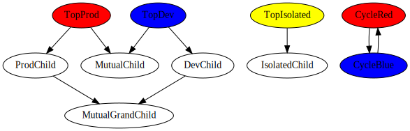
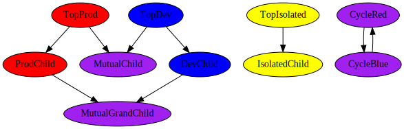

# Graph Hydration

To explain this feature, assume that red dependencies are Production, blue dependencies are Development,
and yellow dependencies are Test.

Here's our starting point after building a graph.

When building the graph, we couldn't know that `ProdChild` should have been red.  We only
knew for sure that `TopProd` should be red.  The same principle applies to `TopDev` being
blue, and `TopIsolated` being yellow.

In this graph, `MutualChild` and `MutualGrandChild` are connected (either directly or
transitively) to both red and blue, so we want them to become both red and blue (we'll
use purple to represent that).

If we *hydrate* the graph, we can let all of the associated data (color) flow through the edges
in the graph, recursively (we don't actually use recursion, because there may be cycles).

Here's what the graph looks like after hydration:

There are 4 things to note:

- In our case, we combine colors, though we could choose to just take the first color or latest
color for any node.  That's left to the user (read: author of the instance of the typeclass) to decide.
- In the main graph, with `TopDev` and `TopProd`, the results are predictable.  Red and blue
both flow downwards, creating purple when they join.
- In the yellow isolated graph, we have no trace of blue or red anywhere, meaning that graph hydration
allows for isolation of subgraphs.
- In the cyclic graph, we ended up with all nodes being the same color.  This is again due to combining
the colors, but if we defined the behavior to overwrite existing colors (or to reject all colors after
the first), we could end up with VERY different graphs.

Graph hydration is handled through the `Hydrateable` typeclass, in the `Graphing.Hydrate` module.
The tests, which can be found in `test/Graphing/HydrateSpec.hs`, should closely resemble these images.
