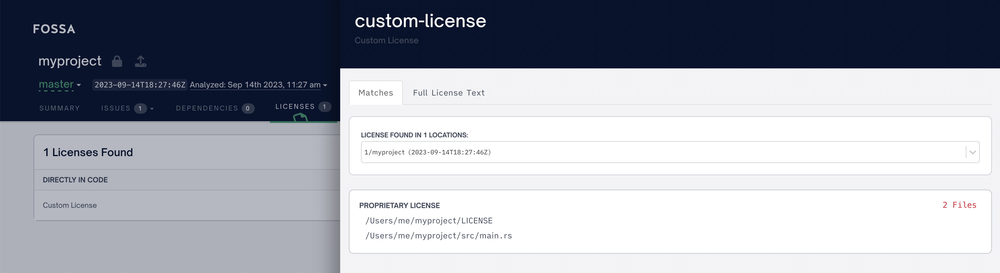
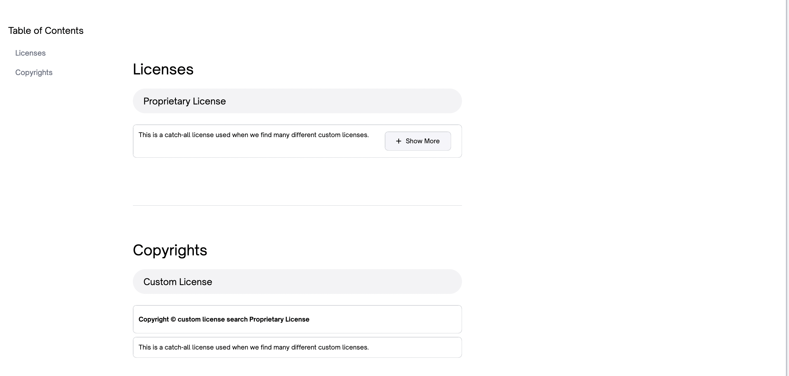
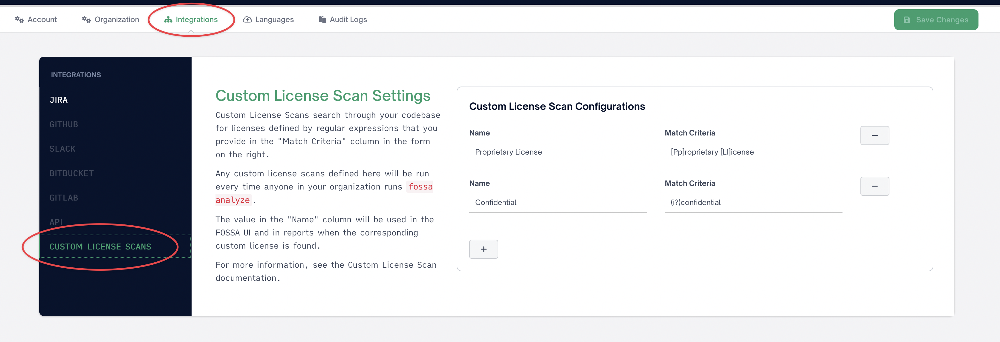

# Custom-License and Keyword Searches

FOSSA offers the ability to search your codebase using regular expressions and to report matches. These matches can be reported in two different ways: Keyword Searches or Custom-License Searches.

For both of these searches, you provide a `name` and a `matchCriteria`. The `name` is a description of what you are searching for. The `matchCriteria` is a regular expression used to find the thing you are searching for.

The simplest way to provide these values is in your `.fossa.yml` config file. Here is an example config file that does both a Keyword Search and a Custom-License Search. It is searching case-insensitively for the phrase "this project is provided under a proprietary license" as a custom license with a name of "Proprietary License". It is search for the string "abc123" as a keyword search with a name of "Password".

```yaml
version: 3

customLicenseSearch:
  - matchCriteria: "(?i)this project is provided under a proprietary license"
    name: "Proprietary License"

experimentalKeywordSearch:
  - matchCriteria: "abc123"
    name: "Password"
```

Both of these searches will run the regular expression provided in the `matchCriteria` field on every non-binary file in the directory that you are scanning. The difference is in how the results are used.

## Keyword Searches

If a match to a keyword search is found, then the results of that search are output in the scan summary that `fossa analyze` outputs. For example, if you have just the `experimentalKeywordSearch` entry in the above `.fossa.yml` file and scan a project that contains the string "abc123" in two files, then you will see something like this in the scan summary:

```
* Keyword Search: succeeded
  ** Password - /Users/me/myproject/something.txt (lines 3-3)
  ** Password - /Users/me/myproject/some/subdirectory/anotherfile.txt (lines 31-31)
```

## Custom License Searches

If a match to a custom-license search is found, then the CLI will add the match to the licenses reported for the project being scanned. The license will be identified as a "Custom License", and the name that you provided will be used in the FOSSA UI and in reports when displaying tha license.

The result will also be output in the scan summary, just as it is for [Keyword Searches](#keyword-searches).

For example, if you have just the `customLicenseSearch` entry in the example `.fossa.yml` above and you find a match to the regular expression in two files, then the scan summary will look something like this:

```
* Custom-License Search: succeeded
  ** Proprietary License - /Users/me/myproject/LICENSE (lines 4-4)
  ** Proprietary License - /Users/me/myproject/src/main.rs (lines 2-3)
```

This will create a custom license match in your project in FOSSA. The results of that in the UI will look something like this:



The custom license will also be included in reports, and will look something like this:



If your project is set to raise issues for a license of type "Custom License", then an issue will be raised for any custom licenses found.

## Regular expression format

The regular expressions in Custom License and Keyword searches use Rust's regular expression syntax. Here are a few examples. You can also view the [full regular expression syntax documentation](./custom-license-and-keyword-search-regular-expression-syntax.md).

### Searching for a phrase with some characters
## Configuring custom-license searches for your whole organization

If you want to scan for the same custom licenses for every project you analyze with `fossa analyze`, you can set up custom license scans in FOSSA's admin UI.

In order to do this you must have permission to edit your admin's Integration Settings. If you have this permission, you can go to the "account settings" page, click on the "Integrations" tab and then the "Custom License Scans" sub-navigation.




You can then add custom license searches. Once you do this, anyone in your organization who runs `fossa analyze` will run the configured custom-license searches.

Any custom-license searches configured in the repositories `.fossa.yml` file will also be run.

### Turning off organization-wide custom-license searches

You can ignore the organization wide custom-license searches by providing the `--ignore-org-wide-custom-license-scan-configs` flag when you run `fossa analyze`:

```
fossa analyze --ignore-org-wide-custom-license-scan-configs
```

You can also set the `ignoreOrgWideCustomLicenseScanConfigs` flag to `true` in your `.fossa.yml` file. For example:

```yaml
version: 3
ignoreOrgWideCustomLicenseScanConfigs: true
```


