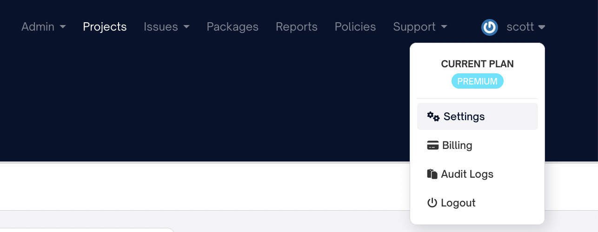

# Custom-License and Keyword Searches

FOSSA offers the ability to search your codebase using regular expressions and to report matches. These matches can be reported in two different ways: Keyword Searches or Custom-License Searches.

For both of these searches, you provide a `name` and a `matchCriteria`. The `name` is a description of what you are searching for. The `matchCriteria` is a regular expression used to find the thing you are searching for.

The simplest way to provide these values is in your `.fossa.yml` config file. Here is an example config file that does both a Keyword Search and a Custom-License Search. It is searching case-insensitively for the phrase "this project is provided under a proprietary license" as a custom license with a name of "Proprietary License". It is also searching for the string "abc123" as a keyword search with a name of "Password".

```yaml
version: 3

customLicenseSearch:
  - matchCriteria: (?i)this project is provided under a proprietary license
    name: Proprietary License

experimentalKeywordSearch:
  - matchCriteria: abc123
    name: Password
```

Both of these searches will run the regular expression provided in the `matchCriteria` field on every non-binary file in the directory that you are searching. The difference is in how the results are used.

## Keyword Searches

If a match to a keyword search is found, then the results of that search are output in the scan summary that `fossa analyze` outputs. For example, if you have just the `experimentalKeywordSearch` entry in the above `.fossa.yml` file and search a project that contains the string "abc123" in two files, then you will see something like this in the scan summary:

```
* Keyword Search: succeeded
  ** Password - /Users/me/myproject/something.txt (lines 3-3)
  ** Password - /Users/me/myproject/some/subdirectory/anotherfile.txt (lines 31-31)
```

## Custom License Searches

If a match to a custom-license search is found, then the CLI will add the match to the licenses reported for the project being searched. The license will be identified as a "Custom License", and the name that you provided will be used in the FOSSA UI and in reports when displaying that license.

The result will also be output in the scan summary, just as it is for [Keyword Searches](#keyword-searches).

For example, if you have just the `customLicenseSearch` entry in the example `.fossa.yml` above and you find a match to the regular expression in two files, then the scan summary will look something like this:

```
* Custom-License Search: succeeded
  ** Proprietary License - /Users/me/myproject/LICENSE (lines 4-4)
  ** Proprietary License - /Users/me/myproject/src/main.rs (lines 2-3)
```

This will create a custom license match in your project in FOSSA. The results of that in the UI will look something like this:


The custom license will also be included in reports, and will look something like this:


Note that the name will be used as the license's name in the UI, so it is important to use names that are understandable to someone looking at license issues and viewing a report.

If your project is set to raise issues for a license of type "Custom License", then an issue will be raised for any custom licenses found.

## Regular expression format

The regular expressions in Custom License and Keyword searches use Rust's regular expression syntax. Here are a few examples. You can also view the [full regular expression syntax documentation](./custom-license-and-keyword-search-regular-expression-syntax.md).

### Escapes in your regular expressions

If you wrap your `matchCriteria` in single quotes or no quotes in `.fossa.yml`, then you should use a single backslash (`\`) to escape characters.

If you use double quotes, then you will need to use two backslashes (`\\`) to escape characters.

So in the example below, we are using the same regular expression three times. Once with double quotes, once with no quotes and the final time with single quotes.

Note that we have to escape the double-quotes in the regular expression when we wrap it in double-quotes.

```yaml
version: 3

customLicenseSearch:
  - matchCriteria: "to any person obtaining a copy of this software and associated documentation files \\(the \"Software\"\\)"
    name: Obtaining Clause, double quotes
  - matchCriteria: to any person obtaining a copy of this software and associated documentation files \(the "Software"\)
    name: Obtaining Clause, no quotes
  - matchCriteria: 'to any person obtaining a copy of this software and associated documentation files \(the "Software"\)'
    name: Obtaining Clause, single quotes
```

We recommend using single quotes or no quotes.

### Searching for a phrase with some characters capitalized

If you want to search for the phrase "proprietary license", but you know that the "P" and the "L" are sometimes capitalized, you can use a [character class](./custom-license-and-keyword-search-regular-expression-syntax.md#character-classes) to match the capitalized and uncapitalized versions.

```
[Pp]roprietary [Ll]icense
```

This will match "Proprietary License", "proprietary license", "proprietary License" and "Proprietary License". It will not match if any of the other characters are capitalized. For example, "PROPRIETARY LICENSE" will not match.

### Ignoring case

You can ignore case by using the case-insensitive [flag](./custom-license-and-keyword-search-regular-expression-syntax.md#character-classes#groupings-and-flags), `i`. This is done by adding `(i?)` to your regular expression. Everything after `(?i)` will be matched case-insenitively.

```
(i?)custom license
```

This will match "Custom License", "CUSTOM LICENSE", "custom license" or "CusTOm LiCenSe".

### Matching newlines

If you have some text that has newlines in it, you can match it by using `\s+` wherever there is a newline.

For example, if you had this text in a file:

> This is one of of my license
>
> and this is the second line

Then you could match this with this regular expression:

```
This is line one of my license\s+and this is the second line
```

We use `\s+` instead of just `\s` so that this will match both Unix-style newlines (which are a single character) and Windows style newlines (which consist of two characters).

The `\s+` character class will match to spaces as well as newlines. So the following text will also match:

> This is one of of my license and this is the second line

### Matching at the beginning or end of a line

In a regular expression, `^` matches to the beginning of the string we are searching in (the haystack) and `$` to the end of the haystack. If you turn on multi-line mode using [`(?m)`](./custom-license-and-keyword-search-regular-expression-syntax.md#character-classes#groupings-and-flags), then `^` matches to the beginning of a line in the haystack and `$` matches to the end of a line.

So if you want to find the string "Permission is hereby granted, free of charge", but only if it happens at the beginning of a line, then you would use this regular expression:

```
(?m)^Permission is hereby granted, free of charge
```

Without the `(?m)`, it would only match at the beginning of a file.

If you wanted to allow some optional whitespace before "Permission", you could add a `\s*` after the  `(?m)` flag, as `\s*` matches zero or more space characters:

```
(?m)^\s*Permission is hereby granted, free of charge
```

Finally, if you also wanted to allow an optional comment delimiter before the license, you could do this:

```
# is for Bash, Perl, Ruby, etc
/*, // and * are for c-like comments
-- is for Haskell
(?m)\s*(#|/\*|\*|//|--)?\s*Permission is hereby granted, free of charge
```

### Matching to a year

To match to a year, you can use the number [character class](./custom-license-and-keyword-search-regular-expression-syntax.md#perl-character-classes-unicode-friendly)) four times. This will match a four digit year:

```
(?i)this document was last updated in \d\d\d\d
```

You could also specify the number of [repetitions](./custom-license-and-keyword-search-regular-expression-syntax.md#repetitions), by putting the number of repetitions in curly quotes (`{4}`), like this:

```
(?i)this document was last updated in \d{4}
```

These regular expressions will both match, for example, "This document was last updated in 2023".

## Configuring custom-license searches for your whole organization

If you want to search for the same custom licenses for every project you analyze with `fossa analyze`, you can set up custom license searches in FOSSA's admin UI.

In order to do this you must have permission to edit your admin's Integration Settings. If you have this permission, you can go to the "account settings" page, click on the "Integrations" tab and then the "Custom License Scans" sub-navigation.




You can then add custom license searches. Once you do this, anyone in your organization who runs `fossa analyze` will run the configured custom-license searches.

Any custom-license searches configured in the repositories `.fossa.yml` file will also be run.

### Escape characters in custom-license searches for your whole organization

The match criteria in the admin interface should be escaped with single backslashes (`\`). For example, if you wanted to match a phrase containing a four-digit year, you would use

```
(?i)this document was last updated in \d\d\d\d
```

### Turning off organization-wide custom-license searches

You can ignore the organization wide custom-license searches by providing the `--ignore-org-wide-custom-license-scan-configs` flag when you run `fossa analyze`:

```
fossa analyze --ignore-org-wide-custom-license-scan-configs
```

You can also set the `ignoreOrgWideCustomLicenseScanConfigs` flag to `true` in your `.fossa.yml` file. For example:

```yaml
version: 3
ignoreOrgWideCustomLicenseScanConfigs: true
```


