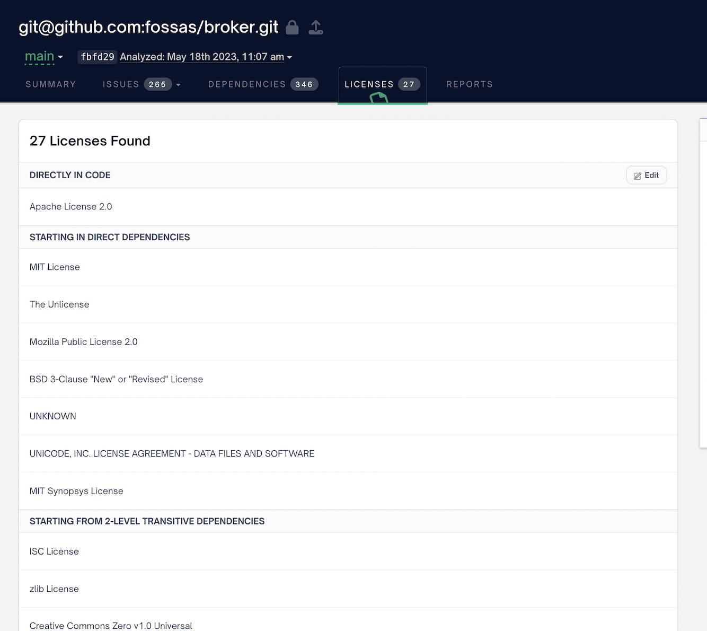

# First-Party License Scans

First-party license scans allow you to find licenses in your project's code.

Normally, FOSSA will find licenses in your dependencies but not scan for licenses found in your code. This is because for most cases the code you are scanning does not contain licenses that you need to comply with.

However, if you do need to find licenses in your code you can do this by running a first-party license scans. The licenses found in your code will show up as "Directly In Code" in the FOSSA UI. For example, here are the results from scanning [broker](https://github.com/fossas/broker), which has an Apache-2.0 license.



By default the FOSSA CLI will not run first-party license scans on your code. You can turn on first-party scans by using the `--experimental-force-first-party-scans` flag. FOSSA can make first-party scans the default for your organization by turning on a feature flag. If you are interested in turning this feature on for your organization, please [contact us](https://support.fossa.com).

We recommend running some analyses with first-party license scans turned on for a few of your projects before turning it on for your whole organization.

You can turn on first-party license scans for an individual scan by using the `--experimental-force-first-party-scans` flag when you run `fossa analyze`. E.g.

```bash
fossa analyze --experimental-force-first-party-scans .
```

If your organization has first-party scans on by default, you can turn off first-party license scans off for an individual scan by using the `--experimental-block-first-party-scans` flag. E.g.

```bash
fossa analyze --experimental-block-first-party-scans .
```

## First-Party License Scans and Vendored Dependencies

The FOSSA CLI's [Vendored Dependency](./vendored-dependencies.md) feature allows you to run a license scan on vendored dependencies.

This is closely related to the first-party license scan feature. Vendored dependency scans are intended to be used when you are scanning third-party code that has been vendored into a directory in your project. Only the directories specified for each vendored dependency will be scanned for licenses, and the vendored dependencies will show up as dependencies in the FOSSA UI.

First-party license scans scan the whole project for licenses, and licenses found are marked as directly found in your code.

You can also combine first-party license scans and vendored dependencies. If you run a first-party license scan and there are vendored dependencies, the FOSSA CLI will skip the vendored dependencies when scanning for licenses in the first-party scan. E.g. if you have a directory structure like this:

```
.
├── FIRST_LICENSE
├── another-dependency.zip
├── fossa-deps.yml
├── src
│   ├── foo.rb
│   ├── src
│       ├── my_project.rb
│       └── subdir
│           └── my_project_again.rb
├── runit
    ├── VENDORED_LICENSE
    ├── foo.rb
    ├── src
        ├── runit.rb
        ├── runit_external.rb
        └── subdir
            └── again.rb
```

And fossa-deps.yml looks like this:

```yaml
vendored-dependencies:
  - name: runit
    path: runit
    version: 2.0.19
```

Then any licenses found in the `runit` directory will be part of the `runit` vendored dependency, and any licenses found in the root or the `src` directory will be found by the first-party license scan and will be reported as licenses found directly in code in the FOSSA UI.
