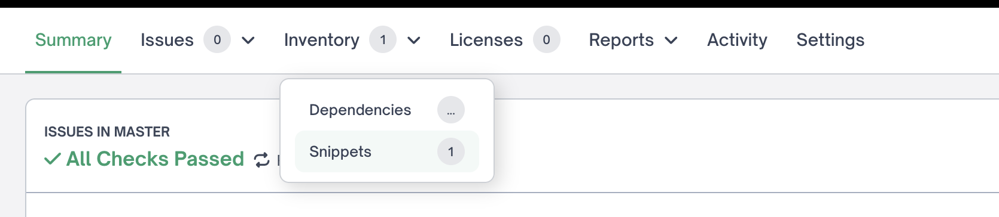
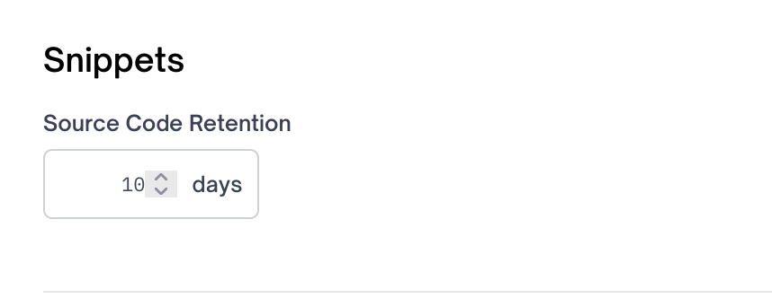
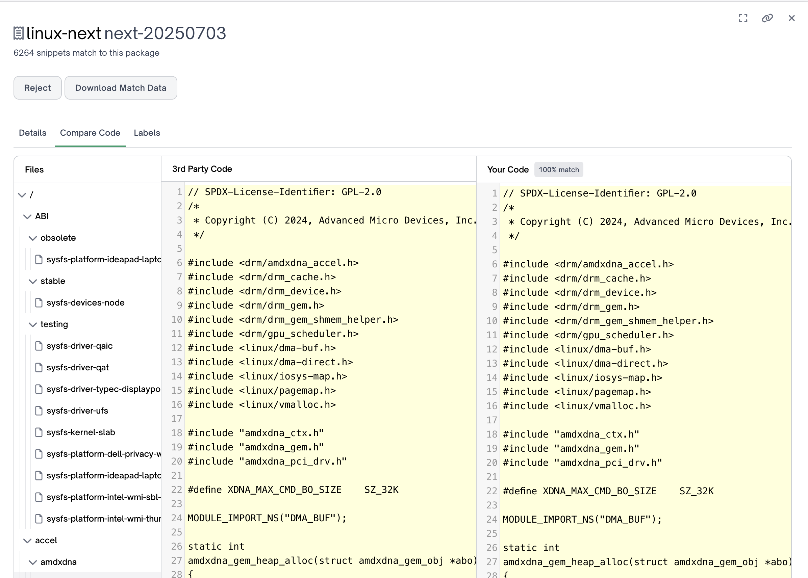

# Snippet Scanning

FOSSA's Snippet Scanning feature searches your codebase for snippets of code that may have been copied from open source projects or other sources (e.g. from StackOverflow).

You run a snippet scan on your codebase by adding the `--x-snippet-scan` flag to the `fossa analyze` command:

```
fossa analyze --x-snippet-scan
```

## Enabling snippet scanning for your organization

Snippet Scanning is not enabled by default, and is only available for enterprise customers. If you would like to enable it for your organization, please [contact us](https://support.fossa.com).

## Snippet Scanning UI

Once you have run a snippet scan, you can see the results in FOSSA's UI under the "snippets" section of the inventory project for the revision that you just scanned.



Clicking on snippets in that dropdown will bring you to the snippet scanning UI.

TODO: either describe this UI or link to documentation about it or ???

## How Snippet Scanning Works

## What data is sent to FOSSA's servers

When we snippet scan your code, we detect snippets in two steps. First, we generate a hash of every file's contents and send that hash to FOSSA. This allows us to determine if we already have snippet scan data for the contents of that file.

If we do not have snippet scan data for that file, then we fingerprint the file. A fingerprint will contain a series of [crc64 hashes](https://en.wikipedia.org/wiki/Cyclic_redundancy_check) generated from the contents of your file, and does not contain any of your file's contents.

We compare the fingerprint that is sent to our servers to fingerprints generated for open source code or other sources. If, and only if, we find a match to a snippet in our knowledge base, then we will send up the contents of the file to our servers. The contents will be stored on our servers for a maximum of 30 days. This time can be configured for your organization by going to <https://app.fossa.com/account/settings/organization> and changing the "Source Code Retention" setting in the "Snippets" section. Note that the Snippets section will only exist if Snippet Scanning has been enabled for your organization.



We store the code on our servers so that you can compare the code in your codebase to the snippet matches that we find.



After 30 days have passed, we will remove the code from our servers.

## A note on scan times

The first time you run a snippet scan on a codebase, it can take a long time to scan. For example, scanning [Linux](https://github.com/torvalds/linux) takes around 60 minutes. This is because we spend quite a bit of time comparing the fingerprints to our knowledge base.

However, the next time you scan that codebase we will already have the snippet data for any unchanged files cached. For example, if you snippet scan Linux a second time, the scan will complete in less than a minute. The time it takes to run that subsequent scan will depend on how many files in the scanned codebase have already been snippet scanned.
