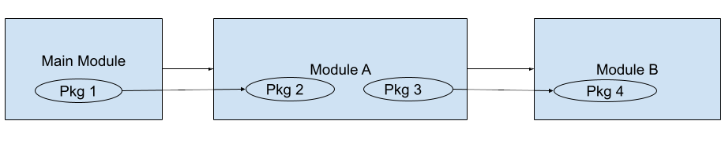

# What is the new package-based Go modules analysis strategy?

In the past, we asked the Go tools for a list of the modules used in an analyzed dependency. 
In Go though, having a module as a dependency doesn’t actually mean that any of its code will be included in the final build product. 
Instead modules are composed of packages which are imported, packages determine what code is actually included in a final build product, and modules are the downloaded unit which provide groups of packages. 
The new strategy first constructs a list of packages used by the final build product and then resolves those packages to their parent module.

For more information on how modules and packages work in Go, please see "How could a module be referenced by a Go project and not be a dependency?" below.

# Why is this change necessary?
Several of our users noticed with the old strategy that they were getting dependencies, sometimes many dependencies, that weren’t actually being used in their projects. 
This was increasing the burden on their compliance and engineering teams by requiring them to fix policy or vulnerability issues reported by FOSSA for packages that weren’t actually being used by the built software. 

# What differences can I expect to see in my results from the new package-based Go module analysis?
The main difference you can expect to see is a reduced number of dependencies and their associated issues. 
For example, if a module includes a package that depends on another module, but that package isn’t actually used by the software under analysis then technically that other module is not a dependency of the final build product. 
The old go modules strategy could not detect this case while the new one will correctly exclude the extra module. 
Additionally, this new strategy should be able to detect test dependencies better than the previous one which results in a further reduction in packages.
        
You may also notice different results if previously your scans were falling back to a static analysis strategy where now with the new Go modules strategy it is able to complete dynamic analysis successfully.

# Should I expect to see test dependencies in the results?
No, test dependencies should be excluded from the results using the new strategy. If they are included, it is likely a bug. Please file a report at https://support.fossa.com.

# How do I use the new package-based Go modules analysis?
This new form of dynamic analysis should be available if you use a version of fossa-cli >= VERSION. # TODO: PUT IN THIS VERSION
Additionally, the system which performs the analysis using fossa-cli should have a Go tool-chain installed. 
Basically, analyzing a project on a system which can successfully build the project should make use of the new strategy. 

# How can I verify that the new package-based Go modules analysis ran for my project?
You can verify that the strategy is running by using the `--debug` flag and looking for a message in the output that says “analysis using go list (V3 Resolver)”.

# What is the relationship between the package-based Go modules analysis and the experimental v3 flag?
They are the same.
In order to get some initial feedback from users on how this new strategy works we initially released it under the --experimental-use-v3-go-resolver flag.
The package-based Go module analysis is the same as the functionality under this flag except it is now the default. 
When using a version of the CLI >= VERSION where it is now the default you can expect to see a warning if you use this flag. 
Eventually, this flag will be fully removed so we recommend removing it from any scripts where you currently have it active.

# Does the package-based Go modules strategy handle local path replacements?
The main limitation of the current strategy is that while we respect Go replace directives, we currently are only able to report on them and their dependencies if they reference a Go module and not a directory. For example, the following replace directive in a go.mod is OK:
```
replace (
    github.com/json-iterator/go v1.1.12 => github.com/json-iterator/go v1.1.11
)
```

While this one is not:
```
replace (
    github.com/json-iterator/go v1.1.12 => ./local_pkgs/go
)
```

The current Go modules strategy also does not handle this case, so this should not result in breakage for users of our current Go strategy. 

A way to handle this case in the meantime is to use vendored dependencies in fossa-deps.yml. 
The lack of automatic support for these dependencies is a known shortcoming of the strategy and something we plan to work on in the future. 

# How could a module be referenced by a Go project and not be a dependency?
In Go, code is distributed in modules which are referenced in go.mod. Modules in this case are containers for packages, which are imported in a Go source file. 
Packages are the main units of code that actually get compiled into the build-product. A Go module can be composed of multiple packages and each package can in turn depend on packages from other modules. 
Many other languages do not have an equivalent concept to modules as a container for code units. 
In those languages including a dependency in a package manager and importing any of its code causes the dependency to be included in the project in its entirety. 
In this case, a dependency is an artifact for both code distribution and code use. 
Because Go modules have both of those concepts separately, we can end up with a situation like the following dependency diagram:



In this diagram modules are denoted using boxes and packages are denoted using ovals. 
At the module level it’s pretty clear what is happening. The Main Module depends on Module A which depends on Module B. 
When looking only at the graph of module dependencies it’s clear that the project depends on both Module A and Module B. 
Considering the packages in a module yields a different set of dependencies than looking at modules alone. 
The Main Module in the diagram contains Package 1 which references Package 2 of Module A. 
Module A also contains Package 3, which references Package 4 in Module B. 
Notice that even though Packages 2 and 3 are part of Module A they don’t depend on each other. 
Further, Package 2 has no dependency on any packages in Module B at all. 
This means that the project containing the Main Module, which only references Package 2 of Module A, wouldn’t actually contain any code at all from Module B.
