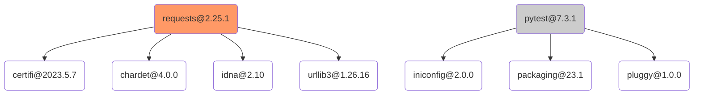
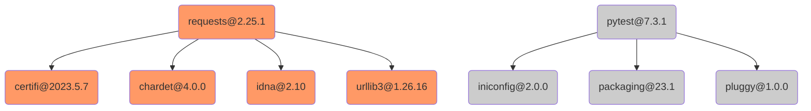

# PDM

[PDM](https://pdm.fming.dev/latest/) is a tool for dependency management and packaging in Python.

## Project Discovery

Find files named `pyproject.toml` and `pdm.lock`.

## Analysis

| Strategy                                       | Direct Deps        | Transitive Deps    | Edges              |
| ---------------------------------------------- | ------------------ | ------------------ | ------------------ |
| `pyproject.toml` and `pdm.lock` are discovered | :heavy_check_mark: | :heavy_check_mark: | :heavy_check_mark: |
| Only `pyproject.toml` is discovered            | :heavy_check_mark: | :x:                | :x:                |
| Only `pdm.lock` is discovered                  | :x:                | :x:                | :x:                |

- :heavy_check_mark: - Supported in all projects
- :x: - Not Supported

We parse `pyproject.toml` to find, 
- direct dependencies, from `[project]'s dependencies`, 
- direct optional dependencies, from `[project.optional-dependencies]`, 
- direct development dependencies, from `[tool.pdm.dev-dependencies]`

FOSSA does not consider optional dependencies, as production
dependencies for PDM, and as such they will be discarded from final analysis findings.

If `pdm.lock` file is discovered, following will be analyzed from lockfile to supplement the analyses:

- `[[package]]` - package's dependencies
- `[[package]].name` - name of the package
- `[[package]].version` - resolved version of the package
- `[[package]].dependencies` - list of dependencies
- `[[package]].git` - git url, if the dependency's source is git vcs
- `[[package]].revision` - revision associated with the git vcs
- `[[package]].path` - local path, if the dependency's source is filesystem

To identify, if the package is `production` dependency, or `development` dependency, `fossa-cli`
hydrates the dependency graph from lockfile with `pyrpoject.toml`. 

1. `fossa-cli` marks any dependency in `pyproject.toml`'s `[]` as production dependencies, 
and rest as development dependencies. 

2. `fossa-cli` propogates this dependency environment marking to all transitive dependencies,
marking all reachable nodes.

For example,



would be hydrated to following graph:



In this graphs, orange signifies production dependency, and gray signifies development dependency,
whereas white signifies unknown environment. If a dependency shared parent who had `development` marking, as well as `production` marking, `fossa-cli` marks this dependency as production dependency.

### Limitations

- Any [local dependencies](https://pdm.fming.dev/latest/usage/dependency/#local-dependencies) will not be reported, by default. To enable, local dependencies in analysis, enable experimental path dependencies. Learn more about [path dependencies and how to enable them](./../../../experimental/path-dependency.md).
- Any dependency using: `hg` (mercurial), `svn` (subversion), `bzr` (bazaar) source, will not be reported.

## Example

1. Create `pyproject.toml` file

```toml
[project]
name = "myexample"
version = "1.0.0"
description = "example pyproject toml file"
authors = [
    {name = "fossa", email = "support@fossa.com"},
]
dependencies = [
    "requests==2.25.1",
]
requires-python = ">=3.11"
license = {text = "MIT"}

[project.optional-dependencies]
extra = ["black"]

[tool.pdm.dev-dependencies]
test = [
    "pytest>=7.3.1",
]
```

1. Perform `pdm lock` to create `pdm.lock` file.

```toml
# This file is @generated by PDM.
# It is not intended for manual editing.

[[package]]
name = "certifi"
version = "2023.5.7"
requires_python = ">=3.6"
summary = "Python package for providing Mozilla's CA Bundle."

[[package]]
name = "chardet"
version = "4.0.0"
requires_python = ">=2.7, !=3.0.*, !=3.1.*, !=3.2.*, !=3.3.*, !=3.4.*"
summary = "Universal encoding detector for Python 2 and 3"

[[package]]
name = "colorama"
version = "0.4.6"
requires_python = "!=3.0.*,!=3.1.*,!=3.2.*,!=3.3.*,!=3.4.*,!=3.5.*,!=3.6.*,>=2.7"
summary = "Cross-platform colored terminal text."

[[package]]
name = "idna"
version = "2.10"
requires_python = ">=2.7, !=3.0.*, !=3.1.*, !=3.2.*, !=3.3.*"
summary = "Internationalized Domain Names in Applications (IDNA)"

[[package]]
name = "iniconfig"
version = "2.0.0"
requires_python = ">=3.7"
summary = "brain-dead simple config-ini parsing"

[[package]]
name = "packaging"
version = "23.1"
requires_python = ">=3.7"
summary = "Core utilities for Python packages"

[[package]]
name = "pluggy"
version = "1.0.0"
requires_python = ">=3.6"
summary = "plugin and hook calling mechanisms for python"

[[package]]
name = "pytest"
version = "7.3.1"
requires_python = ">=3.7"
summary = "pytest: simple powerful testing with Python"
dependencies = [
    "colorama; sys_platform == \"win32\"",
    "iniconfig",
    "packaging",
    "pluggy<2.0,>=0.12",
]

[[package]]
name = "requests"
version = "2.25.1"
requires_python = ">=2.7, !=3.0.*, !=3.1.*, !=3.2.*, !=3.3.*, !=3.4.*"
summary = "Python HTTP for Humans."
dependencies = [
    "certifi>=2017.4.17",
    "chardet<5,>=3.0.2",
    "idna<3,>=2.5",
    "urllib3<1.27,>=1.21.1",
]

[[package]]
name = "urllib3"
version = "1.26.16"
requires_python = ">=2.7, !=3.0.*, !=3.1.*, !=3.2.*, !=3.3.*, !=3.4.*, !=3.5.*"
summary = "HTTP library with thread-safe connection pooling, file post, and more."

[metadata] # not shown for brevity
[metadata.files] # not shown for brevity
```

3. Perform `fossa analyze`

```bash
fossa analyze && fossa test
```

Note: Sometimes with pdm, when you perform `pdm` install, it creates `*.egg-info` directory, 
which contains `requires.txt`. This may introduce additional dependency in the analysis, as
`fossa-cli` will consider `requires.txt` to be `setuptool` manifest. 

To exclude such unwanted dependencies in your analysis, you can use [.fossa.yml](./../../../files/fossa-yml.md)
file to exclude specific paths from the analysis. Here is an example:

```yml
# filename: .fossa.yml

version: 3

paths:
  exclude:
    - ./myexample.egg-info
```

### F.A.Q

1. How do I perform analysis for only `pdm`?

Explicitly specify an analysis target in `.fossa.yml` file. The example below excludes all other analysis targets:

```yaml
# .fossa.yml 

version: 3
targets:
  only:
    - type: pdm
```


2. How do I include optional and development dependencies in the analysis? 

You can include all optional and development dependencies in the analysis using: `--include-unused-deps` flag. If you want to only include optional dependencies in the analysis (without development dependencies), currently this is not possible. 

```bash
fossa analyze --include-unused-deps
```

3. I have path dependency, would FOSSA analyze it's transitive dependencies?

Fossa analysis discraded path dependencies in the analysis, but keeps it's non-path transitive dependencies, 
in the analysis.

### References

- [PDM Source Code](https://github.com/pdm-project/pdm)
- [PDM Documentation](https://pdm.fming.dev/latest/)
