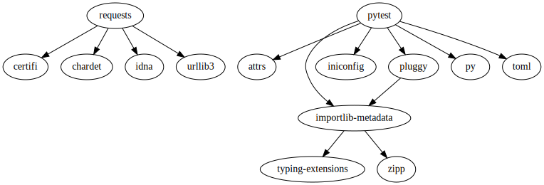

# Pipenv/Pipfile

This is a modern approach to defining python project dependencies, providing
very precise, complete dependency graphs for a python project.

## Project Discovery

Find all files named `Pipfile.lock`

## Analysis

We parse `Pipfile.lock` -- a json-structured file -- to find:

- `sources` - repositories/locations that can be referenced by packages
- `default` - production dependencies
- `develop` - development dependencies

Dependencies may contain an `index` field -- this is a reference to a repository
in the top-level `sources`.

Dependencies contain pinned `version` information.

When possible, we use `pipenv graph --json-tree` to hydrate the edges between
dependencies. This will fail unless `pipenv install` has been run in that directory.

## Limitations

- This strategy does not report edges between dependencies. This means that all dependencies being used in the project are found, but are all reported as direct dependencies of the project.

  - `pipenv graph --json-tree` relies on `pipenv install` being run in the directory beforehand.
  If that command was not run (such as in a freshly cloned repo), then the graph command will fail,
  which means that pipenv analysis will succeed, but with incomplete data (missing edges)
  - The graph command will also fail if `pipenv` is not installed or on the PATH.

## Examples

Pipenv does a lot of work behind the scenes, so even a trivial example is quite large.

`Pipfile` (created by running `pipenv install requests && pipenv install --dev pytest`):

```toml
[[source]]
url = "https://pypi.python.org/simple"
verify_ssl = true
name = "pypi"

[packages]
requests = "*"


[dev-packages]
pytest = "*"
```

`Pipfile.lock` (created at the same time as `Pipfile` above):
*This file is an example, and may not represent the exact versions you would find if you ran this example yourself.*

```json
{
    "_meta": {
        "hash": {
            "sha256": "03f05e808d849011739499ce042685cadfd6f14f4c6784ee3e6ad577b656437a"
        },
        "pipfile-spec": 6,
        "requires": {
            "python_version": "3.6"
        },
        "sources": [
            {
                "name": "pypi",
                "url": "https://pypi.org/simple",
                "verify_ssl": true
            }
        ]
    },
    "default": {
        "certifi": {
            "hashes": [
                "sha256:2bbf76fd432960138b3ef6dda3dde0544f27cbf8546c458e60baf371917ba9ee",
                "sha256:50b1e4f8446b06f41be7dd6338db18e0990601dce795c2b1686458aa7e8fa7d8"
            ],
            "version": "==2021.5.30"
        },
        "chardet": {
            "hashes": [
                "sha256:0d6f53a15db4120f2b08c94f11e7d93d2c911ee118b6b30a04ec3ee8310179fa",
                "sha256:f864054d66fd9118f2e67044ac8981a54775ec5b67aed0441892edb553d21da5"
            ],
            "version": "==4.0.0"
        },
        "idna": {
            "hashes": [
                "sha256:b307872f855b18632ce0c21c5e45be78c0ea7ae4c15c828c20788b26921eb3f6",
                "sha256:b97d804b1e9b523befed77c48dacec60e6dcb0b5391d57af6a65a312a90648c0"
            ],
            "version": "==2.10"
        },
        "requests": {
            "hashes": [
                "sha256:27973dd4a904a4f13b263a19c866c13b92a39ed1c964655f025f3f8d3d75b804",
                "sha256:c210084e36a42ae6b9219e00e48287def368a26d03a048ddad7bfee44f75871e"
            ],
            "index": "pypi",
            "version": "==2.25.1"
        },
        "urllib3": {
            "hashes": [
                "sha256:39fb8672126159acb139a7718dd10806104dec1e2f0f6c88aab05d17df10c8d4",
                "sha256:f57b4c16c62fa2760b7e3d97c35b255512fb6b59a259730f36ba32ce9f8e342f"
            ],
            "version": "==1.26.6"
        }
    },
    "develop": {
        "attrs": {
            "hashes": [
                "sha256:149e90d6d8ac20db7a955ad60cf0e6881a3f20d37096140088356da6c716b0b1",
                "sha256:ef6aaac3ca6cd92904cdd0d83f629a15f18053ec84e6432106f7a4d04ae4f5fb"
            ],
            "version": "==21.2.0"
        },
        "importlib-metadata": {
            "hashes": [
                "sha256:4a5611fea3768d3d967c447ab4e93f567d95db92225b43b7b238dbfb855d70bb",
                "sha256:c6513572926a96458f8c8f725bf0e00108fba0c9583ade9bd15b869c9d726e33"
            ],
            "markers": "python_version < '3.8'",
            "version": "==4.6.0"
        },
        "iniconfig": {
            "hashes": [
                "sha256:011e24c64b7f47f6ebd835bb12a743f2fbe9a26d4cecaa7f53bc4f35ee9da8b3",
                "sha256:bc3af051d7d14b2ee5ef9969666def0cd1a000e121eaea580d4a313df4b37f32"
            ],
            "version": "==1.1.1"
        },
        "packaging": {
            "hashes": [
                "sha256:5b327ac1320dc863dca72f4514ecc086f31186744b84a230374cc1fd776feae5",
                "sha256:67714da7f7bc052e064859c05c595155bd1ee9f69f76557e21f051443c20947a"
            ],
            "version": "==20.9"
        },
        "pluggy": {
            "hashes": [
                "sha256:15b2acde666561e1298d71b523007ed7364de07029219b604cf808bfa1c765b0",
                "sha256:966c145cd83c96502c3c3868f50408687b38434af77734af1e9ca461a4081d2d"
            ],
            "version": "==0.13.1"
        },
        "py": {
            "hashes": [
                "sha256:21b81bda15b66ef5e1a777a21c4dcd9c20ad3efd0b3f817e7a809035269e1bd3",
                "sha256:3b80836aa6d1feeaa108e046da6423ab8f6ceda6468545ae8d02d9d58d18818a"
            ],
            "version": "==1.10.0"
        },
        "pyparsing": {
            "hashes": [
                "sha256:c203ec8783bf771a155b207279b9bccb8dea02d8f0c9e5f8ead507bc3246ecc1",
                "sha256:ef9d7589ef3c200abe66653d3f1ab1033c3c419ae9b9bdb1240a85b024efc88b"
            ],
            "version": "==2.4.7"
        },
        "pytest": {
            "hashes": [
                "sha256:50bcad0a0b9c5a72c8e4e7c9855a3ad496ca6a881a3641b4260605450772c54b",
                "sha256:91ef2131a9bd6be8f76f1f08eac5c5317221d6ad1e143ae03894b862e8976890"
            ],
            "index": "pypi",
            "version": "==6.2.4"
        },
        "toml": {
            "hashes": [
                "sha256:806143ae5bfb6a3c6e736a764057db0e6a0e05e338b5630894a5f779cabb4f9b",
                "sha256:b3bda1d108d5dd99f4a20d24d9c348e91c4db7ab1b749200bded2f839ccbe68f"
            ],
            "version": "==0.10.2"
        },
        "typing-extensions": {
            "hashes": [
                "sha256:0ac0f89795dd19de6b97debb0c6af1c70987fd80a2d62d1958f7e56fcc31b497",
                "sha256:50b6f157849174217d0656f99dc82fe932884fb250826c18350e159ec6cdf342",
                "sha256:779383f6086d90c99ae41cf0ff39aac8a7937a9283ce0a414e5dd782f4c94a84"
            ],
            "markers": "python_version < '3.8'",
            "version": "==3.10.0.0"
        },
        "zipp": {
            "hashes": [
                "sha256:3607921face881ba3e026887d8150cca609d517579abe052ac81fc5aeffdbd76",
                "sha256:51cb66cc54621609dd593d1787f286ee42a5c0adbb4b29abea5a63edc3e03098"
            ],
            "version": "==3.4.1"
        }
    }
}
```

Output of `pipenv graph --json-tree`:

```json
[
    {
        "key": "pytest",
        "package_name": "pytest",
        "installed_version": "6.2.4",
        "required_version": "6.2.4",
        "dependencies": [
            {
                "key": "attrs",
                "package_name": "attrs",
                "installed_version": "21.2.0",
                "required_version": ">=19.2.0",
                "dependencies": []
            },
            {
                "key": "importlib-metadata",
                "package_name": "importlib-metadata",
                "installed_version": "4.6.0",
                "required_version": ">=0.12",
                "dependencies": [
                    {
                        "key": "typing-extensions",
                        "package_name": "typing-extensions",
                        "installed_version": "3.10.0.0",
                        "required_version": ">=3.6.4",
                        "dependencies": []
                    },
                    {
                        "key": "zipp",
                        "package_name": "zipp",
                        "installed_version": "3.4.1",
                        "required_version": ">=0.5",
                        "dependencies": []
                    }
                ]
            },
            {
                "key": "iniconfig",
                "package_name": "iniconfig",
                "installed_version": "1.1.1",
                "required_version": "Any",
                "dependencies": []
            },
            {
                "key": "pluggy",
                "package_name": "pluggy",
                "installed_version": "0.13.1",
                "required_version": ">=0.12,<1.0.0a1",
                "dependencies": [
                    {
                        "key": "importlib-metadata",
                        "package_name": "importlib-metadata",
                        "installed_version": "4.6.0",
                        "required_version": ">=0.12",
                        "dependencies": [
                            {
                                "key": "typing-extensions",
                                "package_name": "typing-extensions",
                                "installed_version": "3.10.0.0",
                                "required_version": ">=3.6.4",
                                "dependencies": []
                            },
                            {
                                "key": "zipp",
                                "package_name": "zipp",
                                "installed_version": "3.4.1",
                                "required_version": ">=0.5",
                                "dependencies": []
                            }
                        ]
                    }
                ]
            },
            {
                "key": "py",
                "package_name": "py",
                "installed_version": "1.10.0",
                "required_version": ">=1.8.2",
                "dependencies": []
            },
            {
                "key": "toml",
                "package_name": "toml",
                "installed_version": "0.10.2",
                "required_version": "Any",
                "dependencies": []
            }
        ]
    },
    {
        "key": "requests",
        "package_name": "requests",
        "installed_version": "2.25.1",
        "required_version": "2.25.1",
        "dependencies": [
            {
                "key": "certifi",
                "package_name": "certifi",
                "installed_version": "2021.5.30",
                "required_version": ">=2017.4.17",
                "dependencies": []
            },
            {
                "key": "chardet",
                "package_name": "chardet",
                "installed_version": "4.0.0",
                "required_version": ">=3.0.2,<5",
                "dependencies": []
            },
            {
                "key": "idna",
                "package_name": "idna",
                "installed_version": "2.10",
                "required_version": ">=2.5,<3",
                "dependencies": []
            },
            {
                "key": "urllib3",
                "package_name": "urllib3",
                "installed_version": "1.26.6",
                "required_version": ">=1.21.1,<1.27",
                "dependencies": []
            }
        ]
    }
]
```

Final graph from our analysis:



Note that request and all of its dependencies are marked as production dependencies, while pytest and all of its dependencies
are marked as development dependencies (since `pipenv` makes no distinction about dev/test).

The versions are omitted here, but are tracked as part of the graph as well.
