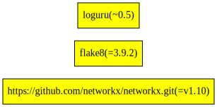

# Poetry

[Poetry](https://python-poetry.org/) is a tool for dependency management and packaging in Python.

## Project Discovery

Find files named `pyproject.toml` and `poetry.lock`. Pyproject must also use poetry for the [build system](https://python-poetry.org/docs/pyproject/#poetry-and-pep-517). If Pyproject does not use poetry build system - project will not be discovered.

## Analysis

We parse `pyproject.toml` to find direct dependencies and their [version constraints](https://python-poetry.org/docs/dependency-specification/):

- `[tool.poetry.dependencies]` - production dependencies
- `[tool.poetry.dev-dependencies]` - development dependencies

If `poetry.lock` file is discovered, following will be analyzed from lockfile to supplement the analyses:

- `[package.dependencies]` - package's dependencies
- `package.category` - package's environment (dev, test, etc.). If not present, defaults to `main`.
- `package.name` - name of the package
- `package.version` - resolved version of the package

If `poetry.lock` file is not discovered, we fallback to reporting only direct dependencies parsed from `pyproject.toml`.

| Strategy                                          | Direct Deps        | Transitive Deps          | Edges              |
| ------------------------------------------------- | ------------------ | ------------------ | ------------------ |
| `pyproject.toml` and `poetry.lock` are discovered | :heavy_check_mark: | :heavy_check_mark: | :heavy_check_mark: |
| Only `pyproject.toml` is discovered               | :heavy_check_mark: | :x:                | :x:                |
| Only `poetry.lock` is discovered                  | :x:                | :x:                | :x:                |

- :heavy_check_mark: - Supported in all projects
- :x: - Not Supported

### Limitations

- For poetry project, build system's `build-backend` must be set to `poetry.core.masonry.api` or `poetry.masonry.api` in `pyproject.toml`. If not done so, it will not discover the project. Refer to [Poetry and PEP-517](https://python-poetry.org/docs/pyproject/#poetry-and-pep-517) for more details.
- All extras specified in `[tool.poetry.extras]` are currently not reported.
- Any [path dependencies](https://python-poetry.org/docs/dependency-specification/#path-dependencies) will not be reported.
- For Poetry version greater or equal to `v1.5.0`, optional dependencies provideded in [dependencies group](https://python-poetry.org/docs/managing-dependencies/#dependency-groups) will not be included in the analysis, even with [--include-unused-deps](../../../subcommands/analyze.md), if only `pyproject.toml` is discovered.

## Example

`pyproject.toml` file (created by `poetry init` and adding relevant dependencies)

```toml
[tool.poetry]
authors = ["User <user@example.com>"]
description = "Example poetry usage"
name = "example-poetry-usage"
version = "0.1.0"

[tool.poetry.dependencies]
loguru = "^0.5"
networkx = {git = "https://github.com/networkx/networkx.git", branch = "v1.10"}
python = "^3.9"

[tool.poetry.dev-dependencies]
flake8 = "3.9.2"

[build-system]
build-backend = "poetry.core.masonry.api"
requires = ["poetry-core>=1.0.0"]
```

and accompanying poetry.lock file (created by poetry at time of dependency resolution)

```toml
[[package]]
name = "colorama"
version = "0.4.4"
description = "Cross-platform colored terminal text."
category = "main"
optional = false
python-versions = ">=2.7, !=3.0.*, !=3.1.*, !=3.2.*, !=3.3.*, !=3.4.*"

[[package]]
name = "decorator"
version = "5.0.9"
description = "Decorators for Humans"
category = "main"
optional = false
python-versions = ">=3.5"

[[package]]
name = "flake8"
version = "3.9.2"
description = "the modular source code checker: pep8 pyflakes and co"
category = "dev"
optional = false
python-versions = "!=3.0.*,!=3.1.*,!=3.2.*,!=3.3.*,!=3.4.*,>=2.7"

[package.dependencies]
mccabe = ">=0.6.0,<0.7.0"
pycodestyle = ">=2.7.0,<2.8.0"
pyflakes = ">=2.3.0,<2.4.0"

[[package]]
name = "loguru"
version = "0.5.3"
description = "Python logging made (stupidly) simple"
category = "main"
optional = false
python-versions = ">=3.5"

[package.dependencies]
colorama = {version = ">=0.3.4", markers = "sys_platform == \"win32\""}
win32-setctime = {version = ">=1.0.0", markers = "sys_platform == \"win32\""}

[package.extras]
dev = ["codecov (>=2.0.15)", "colorama (>=0.3.4)", "flake8 (>=3.7.7)", "tox (>=3.9.0)", "tox-travis (>=0.12)", "pytest (>=4.6.2)", "pytest-cov (>=2.7.1)", "Sphinx (>=2.2.1)", "sphinx-autobuild (>=0.7.1)", "sphinx-rtd-theme (>=0.4.3)", "black (>=19.10b0)", "isort (>=5.1.1)"]

[[package]]
name = "mccabe"
version = "0.6.1"
description = "McCabe checker, plugin for flake8"
category = "dev"
optional = false
python-versions = "*"

[[package]]
name = "networkx"
version = "1.10"
description = "Python package for creating and manipulating graphs and networks"
category = "main"
optional = false
python-versions = "*"
develop = false

[package.dependencies]
decorator = ">=3.4.0"

[package.source]
type = "git"
url = "https://github.com/networkx/networkx.git"
reference = "v1.10"
resolved_reference = "4d364bfcee7b24f3df137e8dcd36f7a547892e55"

[[package]]
name = "pycodestyle"
version = "2.7.0"
description = "Python style guide checker"
category = "dev"
optional = false
python-versions = ">=2.7, !=3.0.*, !=3.1.*, !=3.2.*, !=3.3.*"

[[package]]
name = "pyflakes"
version = "2.3.1"
description = "passive checker of Python programs"
category = "dev"
optional = false
python-versions = ">=2.7, !=3.0.*, !=3.1.*, !=3.2.*, !=3.3.*"

[[package]]
name = "win32-setctime"
version = "1.0.3"
description = "A small Python utility to set file creation time on Windows"
category = "main"
optional = false
python-versions = ">=3.5"

[package.extras]
dev = ["pytest (>=4.6.2)", "black (>=19.3b0)"]

[metadata]
lock-version = "1.1"
python-versions = "^3.9"
content-hash = "31cb32d5165d1cc95e45e9d3e839af556f548df74dda74e25a02b79ba5aa5948"

# [metadata.files] not shown for brevity
```

We will produce the following dependency graph, from our analyses if both `poetry.lock` and `pyproject.toml` are discovered.


_Dependencies highlighted in yellow boxes are direct dependencies, rest are transitive dependencies._

If only, `pyproject.toml` is discovered, following dependency graph will be produced.


_Dependencies highlighted in yellow boxes are direct dependencies, rest are transitive dependencies._

Without `poetry.lock` we are not able to identify any transitive dependencies. We are also unable to locally resolve dependency when version ranges are provided, like `loguru = "^0.5"`.

As `category` is not provided with poetry version greater or equal to [v1.5.0](https://github.com/dependabot/dependabot-core/pull/7418), FOSSA CLI will, first identify "main" dependencies by
using `tool.poetry.dependencies` from `pyproject.toml`. Afterwhich, it will [hydrate](../../../../contributing/graph-hydration.md) dependencies. Any dependencies not hydrated, will be inferred to be a development dependency.

### References

- [Poetry Source Code](https://github.com/python-poetry/poetry)
- [Poetry Documentation](https://python-poetry.org/docs/)
