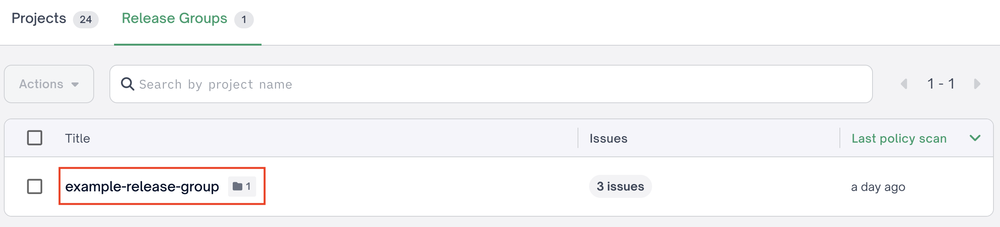
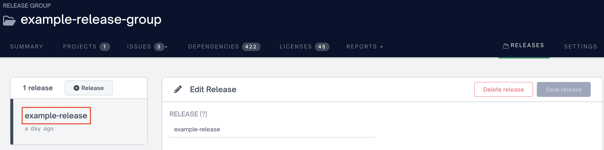
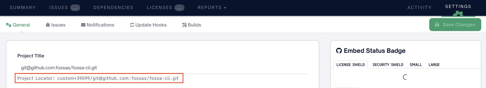
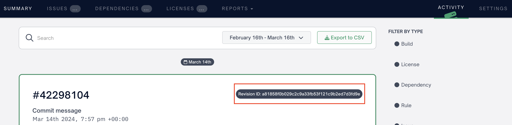

## `fossa release-group`

This `fossa release-group` subcommand allows users to interact with FOSSA release groups.

It has the following subcommands:

- [`fossa release-group add-projects`](./release-group/add-projects.md)
- [`fossa release-group create`](./release-group//create.md)
- [`fossa release-group delete`](./release-group/delete.md)
- [`fossa release-group delete-release`](./release-group/delete-release.md)

See the pages linked above for more details.

### `fossa release-group add-projects`

Add FOSSA projects to a FOSSA release group

>NOTE: The combination of `--project-id` , `--project-revision`, and `--project-branch` are required to identify the project that will be added to the release group. Ensure that you have supplied all arguments for each project that you wish to add.

Example:

```bash
fossa release-group add-projects --title example-title --release example-release-title --project-id custom+1/git@github.com/example --project-revision 12345 --project-branch main
```

### `fossa release-group create`

Create a FOSSA release group

>NOTE: The combination of `--project-id` , `--project-revision`, and `--project-branch` are required to identify the project that will be added to the release group. Ensure that you have supplied all arguments for each project that you wish to add.

Example:

```bash
fossa release-group create --title example-title --release example-release-title --project-id custom+1/git@github.com/example --project-revision 12345 --project-branch main
```

### `fossa release-group delete`

Delete a FOSSA release group

Example:

```bash
fossa release-group delete --title example-title
```

### `fossa release-group delete-release`

Delete a release within a FOSSA release group

Example:

```bash
fossa release-group delete-release --title example-title --release example-release-title 
```

### F.A.Q.

1. Why are `fossa.yml` configurations disabled for `fossa release-group delete` and `fossa release-group delete-release`?

This is done intentionally so that lingering configurations in `fossa.yml` are not extracted and used to mistakenly delete release groups or release group releases.

2. Where can I find my release groups? 

Release groups can be found in the UI on the `Release Groups` page.



3. Where can I find my release group releases?

Releases can be found in the UI on the `Releases` page for your given release group.



4. Where can I find my project locator?

The project locator defines a unique ID that the FOSSA API will use to reference a project. The project locator can be found in the UI on the project `Settings` page listed as the `Project Locator` underneath the `Project Title` setting.



5. Where can I find my project revision ID?

Project revisions can be found in the UI on the project `Activity` page. Refer to `Revision ID` to retrieve the specific revision you want to use for the project.

